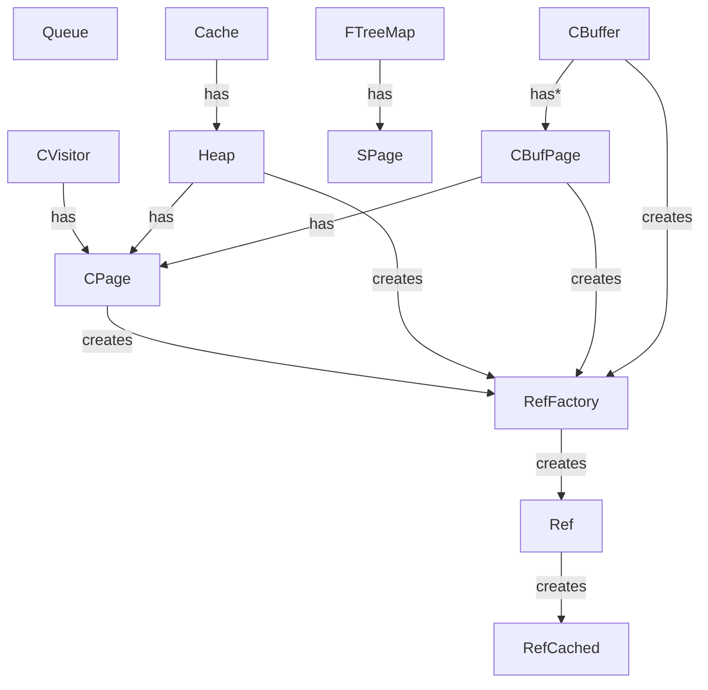

# go-fast

Fast Data Structures for go inspired by work on a game engine. Most of the data structures build off of a slice based data structure `CPage` (Continuous Page) which maintains references(`int`s) to a contiguous block of memory.

There are also fast implementations for Treemaps that use `SPage` (Static Page).

## Organization

See unit tests for usage.
